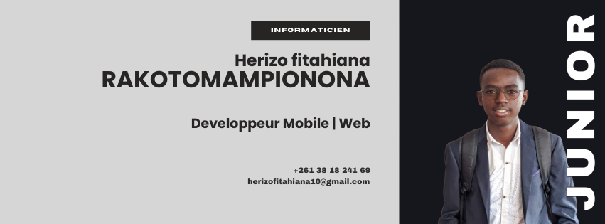

<!-- Bannière personnalisée -->

  

# **Herizo FItahiana    RAKOTOMAMPIONONA **

🎯 **Développeur Web | Mobile | Backend | Data Enthusiast**  
💡 Passionné par le **développement web et mobile**, l'**analyse de données** et les **systèmes distribués**  
📍 **Basé à Madagascar** | 🎓 **Étudiant en 3ème année à ISPM**

📬 Contactez-moi sur 

---

## 🚀 Technologies & Compétences

### 🔹 Langages de programmation

### 🔹 Frameworks & Librairies

### 🔹 Bases de données & Stockage

### 🔹 Outils & DevOps

---

## 📫 Contact & Réseaux

📧 **Email :** herizofitahiana10@gmail.com
💼 **LinkedIn :** [Herizo Rakotomampionona](https://www.linkedin.com/in/fitahiana-herizo-rakotomampionona-586960277/)  
🌍 **Portfolio :** https://cv-portfolio-beta.vercel.app/

---

Merci d'avoir visité mon profil ! 🚀
